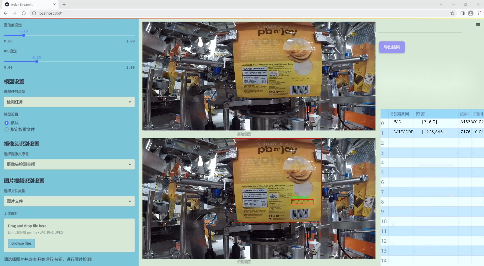
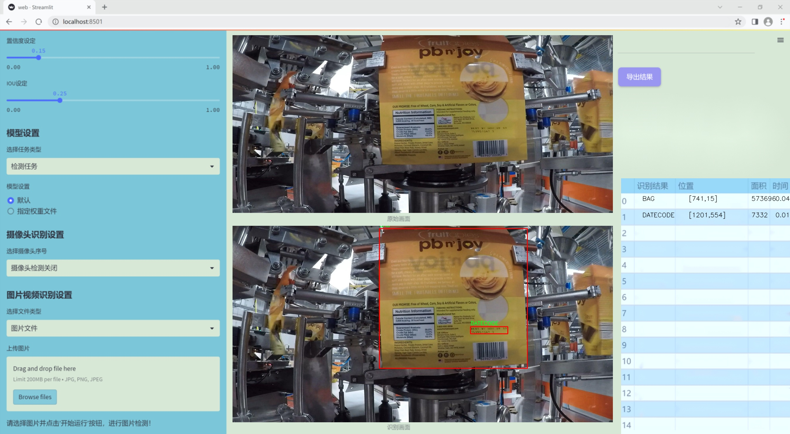
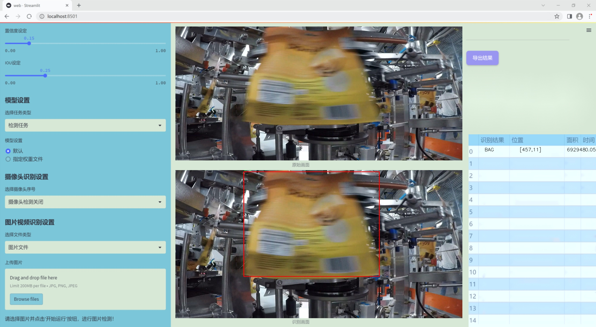
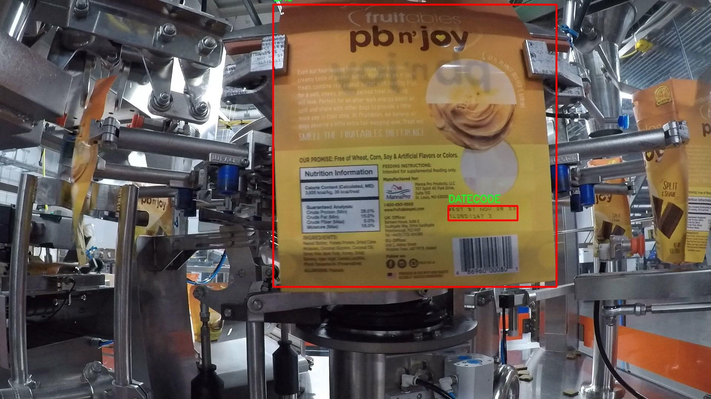
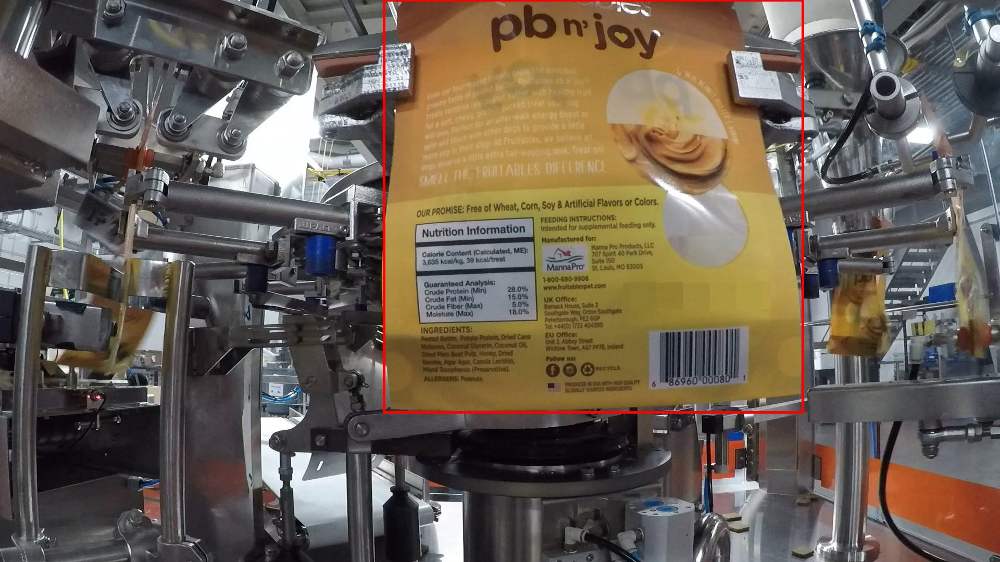
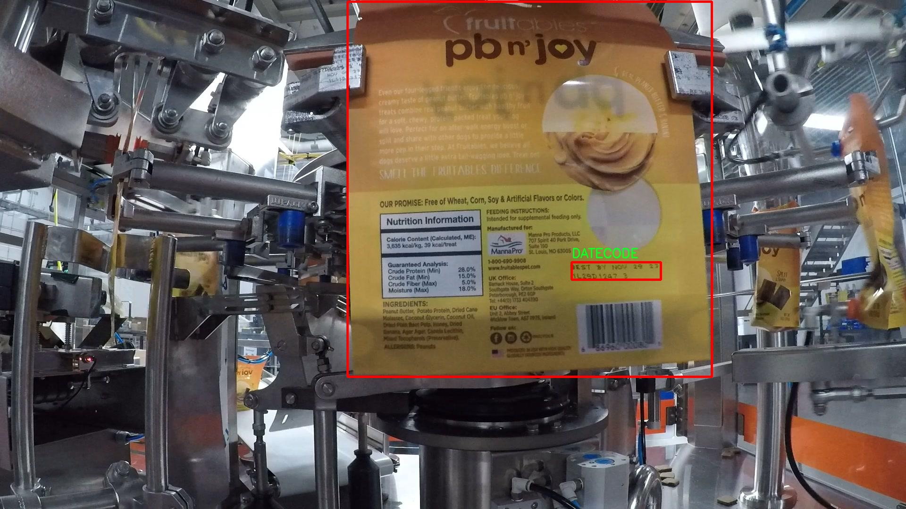
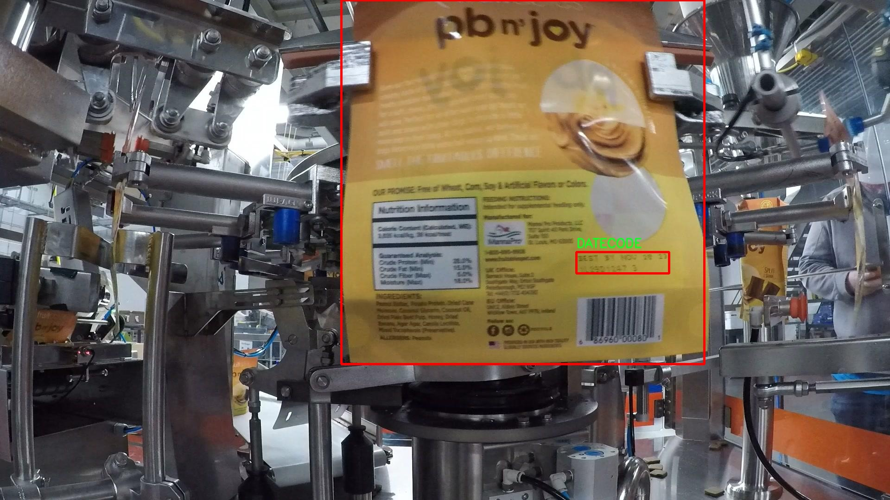
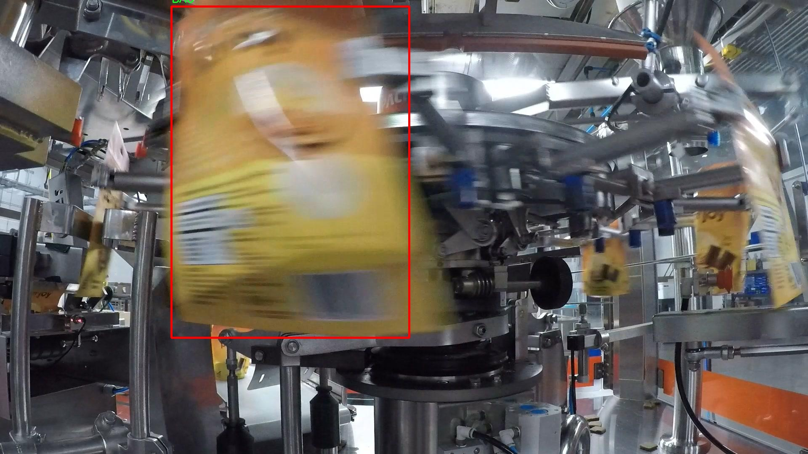

# 改进yolo11-attention等200+全套创新点大全：包装袋与日期码区域检测系统源码＆数据集全套

### 1.图片效果展示







##### 项目来源 **[人工智能促进会 2024.11.01](https://kdocs.cn/l/cszuIiCKVNis)**

注意：由于项目一直在更新迭代，上面“1.图片效果展示”和“2.视频效果展示”展示的系统图片或者视频可能为老版本，新版本在老版本的基础上升级如下：（实际效果以升级的新版本为准）

  （1）适配了YOLOV11的“目标检测”模型和“实例分割”模型，通过加载相应的权重（.pt）文件即可自适应加载模型。

  （2）支持“图片识别”、“视频识别”、“摄像头实时识别”三种识别模式。

  （3）支持“图片识别”、“视频识别”、“摄像头实时识别”三种识别结果保存导出，解决手动导出（容易卡顿出现爆内存）存在的问题，识别完自动保存结果并导出到tempDir中。

  （4）支持Web前端系统中的标题、背景图等自定义修改。

  另外本项目提供训练的数据集和训练教程,暂不提供权重文件（best.pt）,需要您按照教程进行训练后实现图片演示和Web前端界面演示的效果。

### 2.视频效果展示

[2.1 视频效果展示](https://www.bilibili.com/video/BV16VDwYzEgX/)

### 3.背景

研究背景与意义

随着电子商务和物流行业的迅猛发展，包装袋及其上印刷的日期码的自动检测变得愈发重要。包装袋不仅是产品保护的重要组成部分，同时也承载着关键信息，如生产日期、保质期等，直接影响消费者的购买决策和食品安全。因此，开发一种高效、准确的自动检测系统，能够在生产线上实时识别包装袋及其日期码，对于提升生产效率、降低人工成本、确保产品质量具有重要意义。

在现有的目标检测技术中，YOLO（You Only Look Once）系列模型因其高效性和实时性广泛应用于各种物体检测任务。尤其是YOLOv11版本，凭借其在速度和精度上的显著提升，成为了研究者和工业界的热门选择。然而，针对特定应用场景，如包装袋与日期码的检测，YOLOv11仍然面临着一些挑战，包括背景复杂性、物体尺寸变化以及模糊图像等问题。因此，改进YOLOv11以适应这些特定需求，成为了本研究的核心目标。

本项目将基于改进的YOLOv11模型，构建一个专门针对包装袋和日期码区域的检测系统。我们将利用包含127张图像的数据集，涵盖“BAG”和“DATECODE”两个类别，通过数据增强和模型优化，提升检测的准确性和鲁棒性。通过该系统的实现，不仅能够提高包装生产线的自动化水平，还能为相关行业提供一种可行的解决方案，推动智能制造的发展。综上所述，本研究不仅具有重要的理论价值，还有着广泛的实际应用前景。

### 4.数据集信息展示

##### 4.1 本项目数据集详细数据（类别数＆类别名）

nc: 2
names: ['BAG', 'DATECODE']


该项目为【目标检测】数据集，请在【训练教程和Web端加载模型教程（第三步）】这一步的时候按照【目标检测】部分的教程来训练

##### 4.2 本项目数据集信息介绍

本项目数据集信息介绍

本项目所使用的数据集名为“PoC2”，旨在为改进YOLOv11的包装袋与日期码区域检测系统提供高质量的训练数据。该数据集专注于两个主要类别的物体检测，分别是“BAG”（包装袋）和“DATECODE”（日期码）。通过精心收集和标注的图像，PoC2数据集为模型提供了丰富的样本，确保其在实际应用中的有效性和准确性。

在数据集的构建过程中，我们注重多样性和代表性，涵盖了不同类型、形状和颜色的包装袋，以及各种格式和样式的日期码。这种多样性不仅提高了模型的泛化能力，还增强了其在不同环境和条件下的适应性。数据集中包含的图像均经过严格筛选，确保其清晰度和标注的准确性，从而为YOLOv11的训练提供了坚实的基础。

此外，PoC2数据集的设计考虑到了实际应用中的挑战，例如不同光照条件、背景杂乱程度以及包装袋和日期码的不同排列方式。这些因素都可能影响检测系统的性能，因此我们在数据集中尽量模拟这些实际场景，以提升模型在真实环境中的表现。通过这种方式，项目旨在开发出一个更加鲁棒和高效的检测系统，能够在复杂的工业环境中稳定运行。

总之，PoC2数据集的构建不仅是为了支持YOLOv11的训练，更是为了推动包装袋与日期码检测技术的发展，提升其在实际应用中的可靠性和实用性。通过不断优化和扩展数据集，我们期望为相关领域的研究和应用提供更为坚实的数据支撑。











### 5.全套项目环境部署视频教程（零基础手把手教学）

[5.1 所需软件PyCharm和Anaconda安装教程（第一步）](https://www.bilibili.com/video/BV1BoC1YCEKi/?spm_id_from=333.999.0.0&vd_source=bc9aec86d164b67a7004b996143742dc)


[5.2 安装Python虚拟环境创建和依赖库安装视频教程（第二步）](https://www.bilibili.com/video/BV1ZoC1YCEBw?spm_id_from=333.788.videopod.sections&vd_source=bc9aec86d164b67a7004b996143742dc)

### 6.改进YOLOv11训练教程和Web_UI前端加载模型教程（零基础手把手教学）

[6.1 改进YOLOv11训练教程和Web_UI前端加载模型教程（第三步）](https://www.bilibili.com/video/BV1BoC1YCEhR?spm_id_from=333.788.videopod.sections&vd_source=bc9aec86d164b67a7004b996143742dc)


按照上面的训练视频教程链接加载项目提供的数据集，运行train.py即可开始训练



     Epoch   gpu_mem       box       obj       cls    labels  img_size
     1/200     20.8G   0.01576   0.01955  0.007536        22      1280: 100%|██████████| 849/849 [14:42<00:00,  1.04s/it]
               Class     Images     Labels          P          R     mAP@.5 mAP@.5:.95: 100%|██████████| 213/213 [01:14<00:00,  2.87it/s]
                 all       3395      17314      0.994      0.957      0.0957      0.0843

     Epoch   gpu_mem       box       obj       cls    labels  img_size
     2/200     20.8G   0.01578   0.01923  0.007006        22      1280: 100%|██████████| 849/849 [14:44<00:00,  1.04s/it]
               Class     Images     Labels          P          R     mAP@.5 mAP@.5:.95: 100%|██████████| 213/213 [01:12<00:00,  2.95it/s]
                 all       3395      17314      0.996      0.956      0.0957      0.0845

     Epoch   gpu_mem       box       obj       cls    labels  img_size
     3/200     20.8G   0.01561    0.0191  0.006895        27      1280: 100%|██████████| 849/849 [10:56<00:00,  1.29it/s]
               Class     Images     Labels          P          R     mAP@.5 mAP@.5:.95: 100%|███████   | 187/213 [00:52<00:00,  4.04it/s]
                 all       3395      17314      0.996      0.957      0.0957      0.0845


###### [项目数据集下载链接](https://kdocs.cn/l/cszuIiCKVNis)

### 7.原始YOLOv11算法讲解


ultralytics发布了最新的作品YOLOv11，这一次YOLOv11的变化相对于ultralytics公司的上一代作品YOLOv8变化不是很大的（YOLOv9、YOLOv10均不是ultralytics公司作品），其中改变的位置涉及到C2f变为C3K2，在SPPF后面加了一层类似于注意力机制的C2PSA，还有一个变化大家从yaml文件是看不出来的就是它的检测头内部替换了两个DWConv，以及模型的深度和宽度参数进行了大幅度调整，但是在损失函数方面就没有变化还是采用的CIoU作为边界框回归损失，下面带大家深入理解一下ultralytics最新作品YOLOv11的创新点。

**下图为最近的YOLO系列发布时间线！**


* * *

###### YOLOv11和YOLOv8对比

在YOLOYOLOv5，YOLOv8，和YOLOv11是ultralytics公司作品（ultralytics出品必属精品），下面用一张图片从yaml文件来带大家对比一下YOLOv8和YOLOv11的区别，配置文件变得内容比较少大家可以看一卡，左侧为YOLOv8右侧为YOLOv11，不同的点我用黑线标注了出来。


* * *

###### YOLOv11的网络结构解析

下面的图片为YOLOv11的网络结构图。


**其中主要创新点可以总结如下- > **

* * *

1\.
提出C3k2机制，其中C3k2有参数为c3k，其中在网络的浅层c3k设置为False（下图中可以看到c3k2第二个参数被设置为False，就是对应的c3k参数）。


此时所谓的C3k2就相当于YOLOv8中的C2f，其网络结构为一致的，其中的C3k机制的网络结构图如下图所示
**（为什么叫C3k2，我个人理解是因为C3k的调用时C3k其中的参数N固定设置为2的原因，个人理解不一定对** ）。


* * *

2\.
第二个创新点是提出C2PSA机制，这是一个C2（C2f的前身）机制内部嵌入了一个多头注意力机制，在这个过程中我还发现作者尝试了C2fPSA机制但是估计效果不如C2PSA，有的时候机制有没有效果理论上真的很难解释通，下图为C2PSA机制的原理图，仔细观察把Attention哪里去掉则C2PSA机制就变为了C2所以我上面说C2PSA就是C2里面嵌入了一个PSA机制。


* * *

3\.
第三个创新点可以说是原先的解耦头中的分类检测头增加了两个DWConv，具体的对比大家可以看下面两个图下面的是YOLOv11的解耦头，上面的是YOLOv8的解耦头.


我们上面看到了在分类检测头中YOLOv11插入了两个DWConv这样的做法可以大幅度减少参数量和计算量（原先两个普通的Conv大家要注意到卷积和是由3变为了1的，这是形成了两个深度可分离Conv），大家可能不太理解为什么加入了两个DWConv还能够减少计算量，以及什么是深度可分离Conv，下面我来解释一下。

> **`DWConv` 代表 Depthwise
> Convolution（深度卷积）**，是一种在卷积神经网络中常用的高效卷积操作。它主要用于减少计算复杂度和参数量，尤其在移动端或轻量化网络（如
> MobileNet）中十分常见。
>
> **1\. 标准卷积的计算过程**
>
> 在标准卷积操作中，对于一个输入张量（通常是一个多通道的特征图），卷积核的尺寸是 `(h, w, C_in)`，其中 `h` 和 `w`
> 是卷积核的空间尺寸，`C_in`
> 是输入通道的数量。而卷积核与输入张量做的是完整的卷积运算，每个输出通道都与所有输入通道相连并参与卷积操作，导致计算量比较大。
>
> 标准卷积的计算过程是这样的：
>
>   * 每个输出通道是所有输入通道的组合（加权求和），卷积核在每个位置都会计算与所有输入通道的点积。
>   * 假设有 `C_in` 个输入通道和 `C_out` 个输出通道，那么卷积核的总参数量是 `C_in * C_out * h * w`。
>

>
> 2\. **Depthwise Convolution（DWConv）**
>
> 与标准卷积不同， **深度卷积** 将输入的每个通道单独处理，即 **每个通道都有自己的卷积核进行卷积**
> ，不与其他通道进行交互。它可以被看作是标准卷积的一部分，专注于空间维度上的卷积运算。
>
> **深度卷积的计算过程：**
>
>   * 假设输入张量有 `C_in` 个通道，每个通道会使用一个 `h × w`
> 的卷积核进行卷积操作。这个过程称为“深度卷积”，因为每个通道独立进行卷积运算。
>   * 输出的通道数与输入通道数一致，每个输出通道只和对应的输入通道进行卷积，没有跨通道的组合。
>   * 参数量和计算量相比标准卷积大大减少，卷积核的参数量是 `C_in * h * w`。
>

>
> **深度卷积的优点：**
>
>   1. **计算效率高** ：相对于标准卷积，深度卷积显著减少了计算量。它只处理空间维度上的卷积，不再处理通道间的卷积。
>   2.  **参数量减少** ：由于每个卷积核只对单个通道进行卷积，参数量大幅减少。例如，标准卷积的参数量为 `C_in * C_out * h *
> w`，而深度卷积的参数量为 `C_in * h * w`。
>   3.  **结合点卷积可提升效果** ：为了弥补深度卷积缺乏跨通道信息整合的问题，通常深度卷积后会配合 `1x1` 的点卷积（Pointwise
> Convolution）使用，通过 `1x1` 的卷积核整合跨通道的信息。这种组合被称为 **深度可分离卷积** （Depthwise
> Separable Convolution） | **这也是我们本文YOLOv11中的做法** 。
>

>
> 3\. **深度卷积与标准卷积的区别**
>
> 操作类型| 卷积核大小| 输入通道数| 输出通道数| 参数量  
> ---|---|---|---|---  
> 标准卷积| `h × w`| `C_in`| `C_out`| `C_in * C_out * h * w`  
> 深度卷积（DWConv）| `h × w`| `C_in`| `C_in`| `C_in * h * w`  
>  
> 可以看出，深度卷积在相同的卷积核大小下，参数量减少了约 `C_out` 倍
> （细心的人可以发现用最新版本的ultralytics仓库运行YOLOv8参数量相比于之前的YOLOv8以及大幅度减少了这就是因为检测头改了的原因但是名字还是Detect，所以如果你想继续用YOLOv8发表论文做实验那么不要更新最近的ultralytics仓库）。
>
> **4\. 深度可分离卷积 (Depthwise Separable Convolution)**
>
> 深度卷积常与 `1x1` 的点卷积配合使用，这称为深度可分离卷积。其过程如下：
>
>   1. 先对输入张量进行深度卷积，对每个通道独立进行空间卷积。
>   2. 然后通过 `1x1` 点卷积，对通道维度进行混合，整合不同通道的信息。
>

>
> 这样既可以保证计算量的减少，又可以保持跨通道的信息流动。
>
> 5\. **总结**
>
> `DWConv` 是一种高效的卷积方式，通过单独处理每个通道来减少计算量，结合 `1x1`
> 的点卷积，形成深度可分离卷积，可以在保持网络性能的同时极大地减少模型的计算复杂度和参数量。

**看到这里大家应该明白了为什么加入了两个DWConv还能减少参数量以及YOLOv11的检测头创新点在哪里。**

* * *

##### YOLOv11和YOLOv8还有一个不同的点就是其各个版本的模型（N - S - M- L - X）网络深度和宽度变了


可以看到在深度（depth）和宽度
（width）两个地方YOLOv8和YOLOv11是基本上完全不同了，这里我理解这么做的含义就是模型网络变小了，所以需要加深一些模型的放缩倍数来弥补模型之前丧失的能力从而来达到一个平衡。

> **本章总结：**
> YOLOv11的改进点其实并不多更多的都是一些小的结构上的创新，相对于之前的YOLOv5到YOLOv8的创新，其实YOLOv11的创新点不算多，但是其是ultralytics公司的出品，同时ultralytics仓库的使用量是非常多的（不像YOLOv9和YOLOv10）所以在未来的很长一段时间内其实YOLO系列估计不会再更新了，YOLOv11作为最新的SOTA肯定是十分适合大家来发表论文和创新的。
>

### 8.200+种全套改进YOLOV11创新点原理讲解

#### 8.1 200+种全套改进YOLOV11创新点原理讲解大全

由于篇幅限制，每个创新点的具体原理讲解就不全部展开，具体见下列网址中的改进模块对应项目的技术原理博客网址【Blog】（创新点均为模块化搭建，原理适配YOLOv5~YOLOv11等各种版本）

[改进模块技术原理博客【Blog】网址链接](https://gitee.com/qunmasj/good)


#### 8.2 精选部分改进YOLOV11创新点原理讲解

###### 这里节选部分改进创新点展开原理讲解(完整的改进原理见上图和[改进模块技术原理博客链接](https://gitee.com/qunmasj/good)【如果此小节的图加载失败可以通过CSDN或者Github搜索该博客的标题访问原始博客，原始博客图片显示正常】


### Context_Grided_Network(CGNet)简介
参考该博客提出的一种轻量化语义分割模型Context Grided Network(CGNet)，以满足设备的运行需要。

CGNet主要由CG块构建而成，CG块可以学习局部特征和周围环境上下文的联合特征，最后通过引入全局上下文特征进一步改善联合特征的学习。


 
下图给出了在Cityscapes数据集上对现有的一些语义分割模型的测试效果，横轴表示参数量，纵轴表示准确率(mIoU)。可以看出，在参数量较少的情况下，CGNet可以达到一个比较好的准确率。虽与高精度模型相去甚远，但在一些对精度要求不高、对实时性要求比较苛刻的情况下，很有价值。


高精度模型，如DeepLab、DFN、DenseASPP等，动不动就是几十M的参数，很难应用在移动设备上。而上图中红色的模型，相对内存占用较小，但它们的分割精度却不是很高。作者认为主要原因是，这些小网络大多遵循着分类网络的设计思路，并没有考虑语义分割任务更深层次的特点。

空间依赖性和上下文信息对提高分割精度有很大的作用。作者从该角度出发，提出了CG block，并进一步搭建了轻量级语义分割网络CGNet。CG块具有以下特点： 

学习局部特征和上下文特征的联合特征；
通过全局上下文特征改进上述联合特征；
可以贯穿应用在整个网络中，从low level（空间级别）到high level（语义级别）。不像PSPNet、DFN、DenseASPP等，只在编码阶段以后捕捉上下文特征。；
只有3个下采样，相比一般5个下采样的网络，能够更好地保留边缘信息。
CGNet遵循“深而薄”的原则设计，整个网络又51层构成。其中，为了降低计算，大量使用了channel-wise conv.

小型语义分割模型：

需要平衡准确率和系统开销
进化路线：ENet -> ICNet -> ESPNet
这些模型基本都基于分类网络设计，在分割准确率上效果并不是很好
上下文信息模型：

大多数现有模型只考虑解码阶段的上下文信息并且没有利用周围的上下文信息
注意力机制：

CG block使用全局上下文信息计算权重向量，并使用其细化局部特征和周围上下文特征的联合特征

#### Context Guided Block
CG block由4部分组成：


此外，CG block还采用了残差学习。文中提出了局部残差学习（LRL）和全局残差学习（GRL）两种方式。 LRL添加了从输入到联合特征提取器的连接，GRL添加了从输入到全局特征提取器的连接。从直观上来说，GRL比LRL更能促进网络中的信息传递（更像ResNet~~），后面实验部分也进行了测试，的确GRL更能提升分割精度。


CGNet的通用网络结构如下图所示，分为3个stage，第一个stage使用3个卷积层抽取特征，第二和第三个stage堆叠一定数量的CG block，具体个数可以根据情况调整。最后，通过1x1 conv得到分割结果。


下图是用于Cityscapes数据集的CGNet网络细节说明：输入尺寸为3*680*680；stage1连续使用了3个Conv-BN-PReLU组合，首个组合使用了stride=2的卷积，所以得到了1/2分辨率的feature map；stage2和stage3分别使用了多个CG block，且其中使用了不同大小的膨胀卷积核，最终分别得到了1/4和1/8的feature map。

需注意：

stage2&3的输入特征分别由其上一个stage的首个和最后一个block组合给出（参考上图的绿色箭头）；

输入注入机制，图中未体现，实际使用中，作者还将输入图像下采样1/4或1/8，分别给到stage2和stage3的输入中 ，以进一步加强特征传递。

channel-wise conv。为了缩减参数数量，在局部特征提取器和周围上下文特征提取器中使用了channel-wise卷积，可以消除跨通道的计算成本，同时节省内存占用。但是，没有像MobileNet等模型一样，在depth-wise卷积后面接point-wise卷积（1*1 conv），作者解释是，因为CG block需要保持局部特征和周围上下文特征的独立性，而1*1 conv会破坏这种独立性，所以效果欠佳，实验部分也进行了验证。

个人感觉此处应该指的是depth-wise卷积？

官方Git中对该部分的实现如下：


### 9.系统功能展示

图9.1.系统支持检测结果表格显示

  图9.2.系统支持置信度和IOU阈值手动调节

  图9.3.系统支持自定义加载权重文件best.pt(需要你通过步骤5中训练获得)

  图9.4.系统支持摄像头实时识别

  图9.5.系统支持图片识别

  图9.6.系统支持视频识别

  图9.7.系统支持识别结果文件自动保存

  图9.8.系统支持Excel导出检测结果数据


### 10. YOLOv11核心改进源码讲解

#### 10.1 EfficientFormerV2.py

以下是对代码的核心部分进行分析和详细注释的结果：

```python
import torch
import torch.nn as nn
import math
import itertools

class Attention4D(nn.Module):
    """ 
    4D注意力机制模块
    """
    def __init__(self, dim=384, key_dim=32, num_heads=8, attn_ratio=4, resolution=7, act_layer=nn.ReLU, stride=None):
        super().__init__()
        self.num_heads = num_heads  # 注意力头的数量
        self.scale = key_dim ** -0.5  # 缩放因子
        self.key_dim = key_dim  # 键的维度
        self.nh_kd = key_dim * num_heads  # 每个头的维度乘以头的数量

        # 如果有步幅，则进行卷积下采样
        if stride is not None:
            self.resolution = math.ceil(resolution / stride)  # 计算新的分辨率
            self.stride_conv = nn.Sequential(
                nn.Conv2d(dim, dim, kernel_size=3, stride=stride, padding=1, groups=dim),
                nn.BatchNorm2d(dim)
            )
            self.upsample = nn.Upsample(scale_factor=stride, mode='bilinear')  # 上采样
        else:
            self.resolution = resolution
            self.stride_conv = None
            self.upsample = None

        self.N = self.resolution ** 2  # 分辨率的平方
        self.d = int(attn_ratio * key_dim)  # 注意力的维度
        self.dh = self.d * num_heads  # 总的注意力维度

        # 定义查询、键、值的卷积层
        self.q = nn.Sequential(nn.Conv2d(dim, self.num_heads * self.key_dim, 1), nn.BatchNorm2d(self.num_heads * self.key_dim))
        self.k = nn.Sequential(nn.Conv2d(dim, self.num_heads * self.key_dim, 1), nn.BatchNorm2d(self.num_heads * self.key_dim))
        self.v = nn.Sequential(nn.Conv2d(dim, self.num_heads * self.d, 1), nn.BatchNorm2d(self.num_heads * self.d))

        # 定义局部值的卷积层
        self.v_local = nn.Sequential(
            nn.Conv2d(self.num_heads * self.d, self.num_heads * self.d, kernel_size=3, stride=1, padding=1, groups=self.num_heads * self.d),
            nn.BatchNorm2d(self.num_heads * self.d)
        )

        # 定义注意力头的卷积层
        self.talking_head1 = nn.Conv2d(self.num_heads, self.num_heads, kernel_size=1)
        self.talking_head2 = nn.Conv2d(self.num_heads, self.num_heads, kernel_size=1)

        # 定义输出的卷积层
        self.proj = nn.Sequential(act_layer(), nn.Conv2d(self.dh, dim, 1), nn.BatchNorm2d(dim))

        # 计算注意力偏置
        points = list(itertools.product(range(self.resolution), range(self.resolution)))
        attention_offsets = {}
        idxs = []
        for p1 in points:
            for p2 in points:
                offset = (abs(p1[0] - p2[0]), abs(p1[1] - p2[1]))
                if offset not in attention_offsets:
                    attention_offsets[offset] = len(attention_offsets)
                idxs.append(attention_offsets[offset])
        self.attention_biases = nn.Parameter(torch.zeros(num_heads, len(attention_offsets)))  # 注意力偏置参数
        self.register_buffer('attention_bias_idxs', torch.LongTensor(idxs).view(self.N, self.N))  # 注册缓冲区

    def forward(self, x):  # 前向传播
        B, C, H, W = x.shape  # 获取输入的形状
        if self.stride_conv is not None:
            x = self.stride_conv(x)  # 如果有步幅，进行卷积下采样

        # 计算查询、键、值
        q = self.q(x).flatten(2).reshape(B, self.num_heads, -1, self.N).permute(0, 1, 3, 2)
        k = self.k(x).flatten(2).reshape(B, self.num_heads, -1, self.N).permute(0, 1, 2, 3)
        v = self.v(x)
        v_local = self.v_local(v)
        v = v.flatten(2).reshape(B, self.num_heads, -1, self.N).permute(0, 1, 3, 2)

        # 计算注意力权重
        attn = (q @ k) * self.scale + self.attention_biases[:, self.attention_bias_idxs]
        attn = self.talking_head1(attn).softmax(dim=-1)  # 计算softmax
        attn = self.talking_head2(attn)

        # 计算输出
        x = (attn @ v)
        out = x.transpose(2, 3).reshape(B, self.dh, self.resolution, self.resolution) + v_local
        if self.upsample is not None:
            out = self.upsample(out)

        out = self.proj(out)  # 最后的投影
        return out


class EfficientFormerV2(nn.Module):
    """
    EfficientFormerV2模型
    """
    def __init__(self, layers, embed_dims=None, mlp_ratios=4, downsamples=None, num_classes=1000, drop_rate=0., drop_path_rate=0.):
        super().__init__()
        self.patch_embed = nn.Sequential(
            nn.Conv2d(3, embed_dims[0], kernel_size=3, stride=2, padding=1),
            nn.BatchNorm2d(embed_dims[0]),
            nn.ReLU(),
        )  # 初始的卷积嵌入层

        network = []
        for i in range(len(layers)):
            # 构建每一层的网络
            stage = eformer_block(embed_dims[i], i, layers, mlp_ratio=mlp_ratios, drop_rate=drop_rate, drop_path_rate=drop_path_rate)
            network.append(stage)
            if downsamples[i] or embed_dims[i] != embed_dims[i + 1]:
                # 如果需要下采样
                network.append(Embedding(patch_size=3, stride=2, in_chans=embed_dims[i], embed_dim=embed_dims[i + 1]))

        self.network = nn.ModuleList(network)  # 将网络层放入ModuleList中

    def forward(self, x):
        x = self.patch_embed(x)  # 通过初始卷积嵌入层
        for block in self.network:
            x = block(x)  # 通过每一层的网络
        return x


def efficientformerv2_s0(weights='', **kwargs):
    """ 
    创建S0版本的EfficientFormerV2模型
    """
    model = EfficientFormerV2(
        layers=[2, 2, 6, 4],  # 各层的深度
        embed_dims=[32, 48, 96, 176],  # 各层的嵌入维度
        downsamples=[True, True, True, True],  # 是否下采样
        **kwargs
    )
    if weights:
        pretrained_weight = torch.load(weights)['model']
        model.load_state_dict(pretrained_weight)  # 加载预训练权重
    return model

if __name__ == '__main__':
    inputs = torch.randn((1, 3, 640, 640))  # 输入张量
    model = efficientformerv2_s0()  # 创建模型
    res = model(inputs)  # 前向传播
    print(res.size())  # 输出结果的尺寸
```

### 代码核心部分分析
1. **Attention4D 类**：实现了一个4D注意力机制，包含了查询、键、值的计算，以及注意力权重的计算和应用。使用了卷积层来处理输入数据，并且实现了注意力偏置的计算。

2. **EfficientFormerV2 类**：这是整个模型的核心类，负责构建网络结构，包括卷积嵌入层和多个块的组合。每个块的具体实现通过 `eformer_block` 函数生成。

3. **efficientformerv2_s0 函数**：这是一个工厂函数，用于创建S0版本的EfficientFormerV2模型，并可选择加载预训练权重。

### 注释
注释部分详细解释了每个类和函数的作用、输入输出的形状以及关键的计算步骤，以便于理解模型的结构和功能。

该文件实现了一个名为 `EfficientFormerV2` 的深度学习模型，主要用于计算机视觉任务。这个模型是基于高效的变换器架构，旨在提高性能和效率。以下是对文件中代码的逐步分析和说明。

首先，文件导入了一些必要的库，包括 PyTorch 和一些辅助模块。接着，定义了一些超参数，包括不同版本的模型的宽度和深度。这些参数用于构建不同规模的 EfficientFormer 模型，如 S0、S1、S2 和 L 版本。

接下来，定义了一个名为 `Attention4D` 的类，它实现了一个四维注意力机制。这个类的构造函数中，初始化了一些卷积层和注意力相关的参数。`forward` 方法中实现了前向传播的逻辑，包括计算查询、键、值的表示，并通过注意力机制对输入进行加权。

`stem` 函数用于构建模型的初始卷积层，通常用于将输入图像转换为特征图。接下来，定义了 `LGQuery` 类和 `Attention4DDownsample` 类，分别用于局部查询和下采样的注意力机制。

`Embedding` 类负责将输入图像嵌入到一个更高维的空间中，包含了多种实现方式，如轻量级嵌入和基于注意力的嵌入。`Mlp` 类实现了一个多层感知机（MLP），用于特征的进一步处理。

`AttnFFN` 和 `FFN` 类分别实现了带有注意力机制的前馈网络和普通前馈网络。它们结合了注意力和 MLP 的优点，以增强模型的表达能力。

`eformer_block` 函数用于构建 EfficientFormer 的基本块，通过堆叠不同的注意力和前馈网络来形成深层网络。`EfficientFormerV2` 类是整个模型的核心，负责整合所有的模块，构建完整的网络结构。

在 `EfficientFormerV2` 的构造函数中，模型的层数、嵌入维度、下采样方式等都被初始化。`forward_tokens` 方法实现了模型的前向传播，输出特征图。

文件还定义了一些函数，如 `update_weight` 用于更新模型权重，`efficientformerv2_s0`、`efficientformerv2_s1`、`efficientformerv2_s2` 和 `efficientformerv2_l` 函数用于创建不同规模的 EfficientFormerV2 模型，并加载预训练权重。

最后，在 `__main__` 部分，创建了几个不同版本的模型实例，并通过随机输入进行测试，输出每个模型的输出尺寸。

总体而言，该文件实现了一个高效的视觉变换器模型，具有灵活的架构和多种配置选项，适用于各种计算机视觉任务。

#### 10.2 kacn_conv.py

以下是保留的核心代码部分，并附上详细的中文注释：

```python
import torch
import torch.nn as nn

class KACNConvNDLayer(nn.Module):
    def __init__(self, conv_class, norm_class, input_dim, output_dim, degree, kernel_size,
                 groups=1, padding=0, stride=1, dilation=1,
                 ndim: int = 2, dropout=0.0):
        super(KACNConvNDLayer, self).__init__()
        
        # 初始化参数
        self.inputdim = input_dim  # 输入维度
        self.outdim = output_dim    # 输出维度
        self.degree = degree         # 多项式的度数
        self.kernel_size = kernel_size  # 卷积核大小
        self.padding = padding       # 填充
        self.stride = stride         # 步幅
        self.dilation = dilation     # 膨胀
        self.groups = groups         # 分组卷积的组数
        self.ndim = ndim             # 数据的维度（1D, 2D, 3D）
        self.dropout = None          # Dropout层初始化为None

        # 如果dropout大于0，则根据维度选择合适的Dropout层
        if dropout > 0:
            if ndim == 1:
                self.dropout = nn.Dropout1d(p=dropout)
            elif ndim == 2:
                self.dropout = nn.Dropout2d(p=dropout)
            elif ndim == 3:
                self.dropout = nn.Dropout3d(p=dropout)

        # 检查分组数的有效性
        if groups <= 0:
            raise ValueError('groups must be a positive integer')
        if input_dim % groups != 0:
            raise ValueError('input_dim must be divisible by groups')
        if output_dim % groups != 0:
            raise ValueError('output_dim must be divisible by groups')

        # 初始化归一化层
        self.layer_norm = nn.ModuleList([norm_class(output_dim // groups) for _ in range(groups)])

        # 初始化多项式卷积层
        self.poly_conv = nn.ModuleList([conv_class((degree + 1) * input_dim // groups,
                                                   output_dim // groups,
                                                   kernel_size,
                                                   stride,
                                                   padding,
                                                   dilation,
                                                   groups=1,
                                                   bias=False) for _ in range(groups)])
        
        # 创建一个缓冲区用于存储多项式的指数
        arange_buffer_size = (1, 1, -1,) + tuple(1 for _ in range(ndim))
        self.register_buffer("arange", torch.arange(0, degree + 1, 1).view(*arange_buffer_size))
        
        # 使用Kaiming均匀分布初始化卷积层的权重
        for conv_layer in self.poly_conv:
            nn.init.normal_(conv_layer.weight, mean=0.0, std=1 / (input_dim * (degree + 1) * kernel_size ** ndim))

    def forward_kacn(self, x, group_index):
        # 前向传播，应用激活函数和线性变换
        x = torch.tanh(x)  # 应用tanh激活函数
        x = x.acos().unsqueeze(2)  # 计算反余弦并增加一个维度
        x = (x * self.arange).flatten(1, 2)  # 乘以多项式指数并展平
        x = x.cos()  # 计算余弦
        x = self.poly_conv[group_index](x)  # 通过对应的卷积层
        x = self.layer_norm[group_index](x)  # 通过对应的归一化层
        if self.dropout is not None:
            x = self.dropout(x)  # 应用dropout
        return x

    def forward(self, x):
        # 前向传播，处理输入数据
        split_x = torch.split(x, self.inputdim // self.groups, dim=1)  # 按组分割输入
        output = []
        for group_ind, _x in enumerate(split_x):
            y = self.forward_kacn(_x.clone(), group_ind)  # 对每个组进行前向传播
            output.append(y.clone())  # 保存输出
        y = torch.cat(output, dim=1)  # 合并所有组的输出
        return y
```

### 代码说明：
1. **KACNConvNDLayer**：这是一个自定义的卷积层类，支持多维卷积（1D、2D、3D），并结合了多项式卷积和归一化。
2. **初始化方法**：设置了输入输出维度、卷积参数、分组数、dropout等，并初始化了卷积层和归一化层。
3. **forward_kacn方法**：实现了对输入数据的前向传播，包含激活函数、反余弦、余弦计算以及卷积和归一化操作。
4. **forward方法**：将输入数据按组分割，并对每组数据调用`forward_kacn`进行处理，最后将结果合并返回。

这个程序文件定义了一个名为 `kacn_conv.py` 的模块，主要用于实现一种新的卷积层，称为 KACN（Kacn Activation Convolutional Network）卷积层。该模块使用 PyTorch 框架构建，包含了多个类，主要是 `KACNConvNDLayer` 及其衍生类 `KACNConv1DLayer`、`KACNConv2DLayer` 和 `KACNConv3DLayer`。

首先，`KACNConvNDLayer` 是一个通用的 N 维卷积层类。它的构造函数接受多个参数，包括卷积层类型、归一化层类型、输入和输出维度、卷积核大小、分组数、填充、步幅、扩张、维度数量以及 dropout 概率。该类在初始化时会检查分组数、输入和输出维度的有效性，并根据给定的 dropout 概率选择合适的 dropout 类型（1D、2D 或 3D）。

在构造函数中，使用 `nn.ModuleList` 创建了多个卷积层和归一化层，分别对应于每个分组。卷积层的权重使用 Kaiming 正态分布进行初始化，以便于模型的训练开始时更为有效。`arange` 是一个缓冲区，用于存储从 0 到 degree 的数值，这在后续的前向传播中会用到。

`forward_kacn` 方法实现了 KACN 的前向传播逻辑。首先对输入进行激活处理，然后进行线性变换和一系列的数学操作，包括反余弦、乘以 `arange`、余弦等，最后通过对应的卷积层和归一化层进行处理，并可选地应用 dropout。

`forward` 方法则负责处理整个输入张量。它将输入按分组进行切分，然后对每个分组调用 `forward_kacn` 方法进行处理，最后将所有分组的输出拼接在一起返回。

接下来的三个类 `KACNConv1DLayer`、`KACNConv2DLayer` 和 `KACNConv3DLayer` 分别是 `KACNConvNDLayer` 的具体实现，专门用于处理 1D、2D 和 3D 的卷积操作。它们在初始化时调用父类的构造函数，并传入相应的卷积和归一化层类型。

总的来说，这个模块提供了一种灵活的方式来创建 KACN 卷积层，支持多种维度的卷积操作，并且在实现中考虑了分组卷积、归一化和 dropout 等特性，适合用于深度学习模型的构建。

#### 10.3 SwinTransformer.py

以下是代码中最核心的部分，并附上详细的中文注释：

```python
import torch
import torch.nn as nn
import torch.nn.functional as F
import numpy as np

class Mlp(nn.Module):
    """ 多层感知机（MLP）模块。"""

    def __init__(self, in_features, hidden_features=None, out_features=None, act_layer=nn.GELU, drop=0.):
        super().__init__()
        out_features = out_features or in_features  # 输出特征数默认为输入特征数
        hidden_features = hidden_features or in_features  # 隐藏层特征数默认为输入特征数
        self.fc1 = nn.Linear(in_features, hidden_features)  # 第一层线性变换
        self.act = act_layer()  # 激活函数
        self.fc2 = nn.Linear(hidden_features, out_features)  # 第二层线性变换
        self.drop = nn.Dropout(drop)  # Dropout层

    def forward(self, x):
        """ 前向传播函数。"""
        x = self.fc1(x)  # 线性变换
        x = self.act(x)  # 激活
        x = self.drop(x)  # Dropout
        x = self.fc2(x)  # 线性变换
        x = self.drop(x)  # Dropout
        return x


class WindowAttention(nn.Module):
    """ 基于窗口的多头自注意力模块。"""

    def __init__(self, dim, window_size, num_heads, qkv_bias=True, attn_drop=0., proj_drop=0.):
        super().__init__()
        self.dim = dim  # 输入通道数
        self.window_size = window_size  # 窗口大小
        self.num_heads = num_heads  # 注意力头数
        head_dim = dim // num_heads  # 每个头的维度
        self.scale = head_dim ** -0.5  # 缩放因子

        # 定义相对位置偏置参数表
        self.relative_position_bias_table = nn.Parameter(
            torch.zeros((2 * window_size[0] - 1) * (2 * window_size[1] - 1), num_heads))  # 位置偏置表

        # 计算相对位置索引
        coords_h = torch.arange(self.window_size[0])
        coords_w = torch.arange(self.window_size[1])
        coords = torch.stack(torch.meshgrid([coords_h, coords_w]))  # 生成坐标网格
        coords_flatten = torch.flatten(coords, 1)  # 展平坐标
        relative_coords = coords_flatten[:, :, None] - coords_flatten[:, None, :]  # 计算相对坐标
        relative_coords = relative_coords.permute(1, 2, 0).contiguous()  # 调整维度
        relative_coords[:, :, 0] += self.window_size[0] - 1  # 坐标偏移
        relative_coords[:, :, 1] += self.window_size[1] - 1
        relative_coords[:, :, 0] *= 2 * self.window_size[1] - 1
        relative_position_index = relative_coords.sum(-1)  # 计算相对位置索引
        self.register_buffer("relative_position_index", relative_position_index)  # 注册为缓冲区

        self.qkv = nn.Linear(dim, dim * 3, bias=qkv_bias)  # 线性变换生成Q、K、V
        self.attn_drop = nn.Dropout(attn_drop)  # 注意力权重的Dropout
        self.proj = nn.Linear(dim, dim)  # 输出线性变换
        self.proj_drop = nn.Dropout(proj_drop)  # 输出的Dropout
        self.softmax = nn.Softmax(dim=-1)  # Softmax层

    def forward(self, x, mask=None):
        """ 前向传播函数。"""
        B_, N, C = x.shape  # B_: 批量大小, N: 窗口内的token数, C: 通道数
        qkv = self.qkv(x).reshape(B_, N, 3, self.num_heads, C // self.num_heads).permute(2, 0, 3, 1, 4)  # 计算Q、K、V
        q, k, v = qkv[0], qkv[1], qkv[2]  # 分离Q、K、V

        q = q * self.scale  # 缩放Q
        attn = (q @ k.transpose(-2, -1))  # 计算注意力权重

        # 添加相对位置偏置
        relative_position_bias = self.relative_position_bias_table[self.relative_position_index.view(-1)].view(
            self.window_size[0] * self.window_size[1], self.window_size[0] * self.window_size[1], -1)  # 计算相对位置偏置
        relative_position_bias = relative_position_bias.permute(2, 0, 1).contiguous()  # 调整维度
        attn = attn + relative_position_bias.unsqueeze(0)  # 加入偏置

        attn = self.softmax(attn)  # 归一化注意力权重
        attn = self.attn_drop(attn)  # Dropout

        x = (attn @ v).transpose(1, 2).reshape(B_, N, C)  # 计算输出
        x = self.proj(x)  # 线性变换
        x = self.proj_drop(x)  # Dropout
        return x


class SwinTransformer(nn.Module):
    """ Swin Transformer主干网络。"""

    def __init__(self, pretrain_img_size=224, patch_size=4, in_chans=3, embed_dim=96, depths=[2, 2, 6, 2],
                 num_heads=[3, 6, 12, 24], window_size=7, mlp_ratio=4., drop_rate=0., attn_drop_rate=0.,
                 drop_path_rate=0.2, norm_layer=nn.LayerNorm, ape=False, patch_norm=True, out_indices=(0, 1, 2, 3)):
        super().__init__()

        self.patch_embed = PatchEmbed(patch_size=patch_size, in_chans=in_chans, embed_dim=embed_dim)  # 图像分块嵌入

        self.layers = nn.ModuleList()  # 存储各层
        for i_layer in range(len(depths)):
            layer = BasicLayer(
                dim=int(embed_dim * 2 ** i_layer),
                depth=depths[i_layer],
                num_heads=num_heads[i_layer],
                window_size=window_size,
                mlp_ratio=mlp_ratio,
                drop=drop_rate,
                attn_drop=attn_drop_rate,
                norm_layer=norm_layer)
            self.layers.append(layer)  # 添加层

    def forward(self, x):
        """ 前向传播函数。"""
        x = self.patch_embed(x)  # 进行图像分块嵌入

        outs = []
        for i in range(len(self.layers)):
            layer = self.layers[i]
            x_out, _, _, x, _, _ = layer(x)  # 通过每一层
            outs.append(x_out)  # 收集输出

        return outs  # 返回所有层的输出


def SwinTransformer_Tiny(weights=''):
    """ 创建Swin Transformer Tiny模型。"""
    model = SwinTransformer(depths=[2, 2, 6, 2], num_heads=[3, 6, 12, 24])  # 初始化模型
    if weights:
        model.load_state_dict(torch.load(weights)['model'])  # 加载权重
    return model
```

### 主要功能
1. **Mlp**: 实现了一个多层感知机，包含两层线性变换和激活函数。
2. **WindowAttention**: 实现了基于窗口的多头自注意力机制，支持相对位置偏置。
3. **SwinTransformer**: 构建了Swin Transformer模型，包含多个基本层和图像分块嵌入。

这个程序文件实现了Swin Transformer模型，主要用于计算机视觉任务。Swin Transformer是一种分层的视觉Transformer架构，采用了局部窗口注意力机制和分块合并策略，以提高模型的效率和性能。

首先，文件导入了必要的库，包括PyTorch和一些辅助函数。接着定义了多个类和函数，构成了Swin Transformer的各个组成部分。

Mlp类实现了一个多层感知机（MLP），包含两个线性层和一个激活函数（默认为GELU），以及可选的Dropout层。这个类用于后续的特征处理。

window_partition和window_reverse函数用于将输入特征分割成窗口和将窗口合并回原始特征。它们在局部窗口注意力机制中起到关键作用。

WindowAttention类实现了基于窗口的多头自注意力机制，支持相对位置偏置。它的构造函数定义了输入通道数、窗口大小、注意力头数等参数，并初始化了相关的权重。forward方法实现了自注意力的计算，包括查询、键、值的计算，以及相对位置偏置的应用。

SwinTransformerBlock类是Swin Transformer的基本构建块，包含了规范化层、窗口注意力层和MLP。它的forward方法处理输入特征，进行窗口划分、注意力计算和特征融合。

PatchMerging类用于将特征图进行合并，减少特征图的空间维度，同时增加通道数。它在每个阶段的末尾使用，以便将特征图的尺寸减半。

BasicLayer类代表Swin Transformer的一个基本层，包含多个SwinTransformerBlock，并可选择在层的末尾进行下采样。它的forward方法计算注意力掩码，并逐层传递特征。

PatchEmbed类将输入图像划分为不重叠的补丁，并通过卷积层将其嵌入到特征空间中。它支持可选的归一化层。

SwinTransformer类是整个模型的主类，负责构建整个Swin Transformer的架构。它的构造函数初始化了各个层，并设置了位置嵌入、Dropout等参数。forward方法将输入图像传递通过补丁嵌入、各个层，并返回指定层的输出。

最后，update_weight函数用于更新模型的权重，确保加载的权重与模型结构相匹配。SwinTransformer_Tiny函数创建一个Swin Transformer模型实例，并可选择加载预训练权重。

总体而言，这个文件实现了Swin Transformer的核心结构，包含了各个模块的定义和前向传播逻辑，为计算机视觉任务提供了强大的模型基础。

#### 10.4 test_selective_scan_easy.py

以下是代码中最核心的部分，并附上详细的中文注释：

```python
import torch
import torch.nn.functional as F

def selective_scan_easy(us, dts, As, Bs, Cs, Ds, delta_bias=None, delta_softplus=False, return_last_state=False, chunksize=64):
    """
    选择性扫描函数，执行基于输入的状态和时间增量的扫描操作。
    
    参数：
    us: 输入张量，形状为 (B, G * D, L)
    dts: 时间增量张量，形状为 (B, G * D, L)
    As: 权重张量，形状为 (G * D, N)
    Bs: 权重张量，形状为 (B, G, N, L)
    Cs: 权重张量，形状为 (B, G, N, L)
    Ds: 可选的偏置张量，形状为 (G * D)
    delta_bias: 可选的偏置调整，形状为 (G * D)
    delta_softplus: 是否对时间增量应用softplus函数
    return_last_state: 是否返回最后的状态
    chunksize: 每次处理的块大小
    """
    
    def selective_scan_chunk(us, dts, As, Bs, Cs, hprefix):
        """
        处理每个块的选择性扫描逻辑。
        
        参数：
        us: 输入张量的块
        dts: 时间增量的块
        As: 权重张量
        Bs: 权重张量的块
        Cs: 权重张量的块
        hprefix: 前一个状态的输出
        
        返回：
        ys: 当前块的输出
        hs: 当前块的状态
        """
        ts = dts.cumsum(dim=0)  # 计算时间增量的累积和
        Ats = torch.einsum("gdn,lbgd->lbgdn", As, ts).exp()  # 计算权重的指数
        scale = 1  # 缩放因子
        rAts = Ats / scale  # 归一化的权重
        duts = dts * us  # 计算输入和时间增量的乘积
        dtBus = torch.einsum("lbgd,lbgn->lbgdn", duts, Bs)  # 计算时间增量与权重的乘积
        hs_tmp = rAts * (dtBus / rAts).cumsum(dim=0)  # 计算状态的临时值
        hs = hs_tmp + Ats * hprefix.unsqueeze(0)  # 计算当前状态
        ys = torch.einsum("lbgn,lbgdn->lbgd", Cs, hs)  # 计算输出
        return ys, hs

    # 数据类型设置
    dtype = torch.float32
    inp_dtype = us.dtype  # 输入数据类型
    has_D = Ds is not None  # 检查是否有D
    if chunksize < 1:
        chunksize = Bs.shape[-1]  # 如果块大小小于1，则使用Bs的最后一个维度大小

    # 对时间增量进行处理
    dts = dts.to(dtype)
    if delta_bias is not None:
        dts = dts + delta_bias.view(1, -1, 1).to(dtype)  # 应用偏置
    if delta_softplus:
        dts = F.softplus(dts)  # 应用softplus函数

    # 处理输入张量的维度
    if len(Bs.shape) == 3:
        Bs = Bs.unsqueeze(1)
    if len(Cs.shape) == 3:
        Cs = Cs.unsqueeze(1)
    B, G, N, L = Bs.shape  # 获取批次大小、组数、状态维度和序列长度
    us = us.view(B, G, -1, L).permute(3, 0, 1, 2).to(dtype)  # 调整输入张量的维度
    dts = dts.view(B, G, -1, L).permute(3, 0, 1, 2).to(dtype)  # 调整时间增量的维度
    As = As.view(G, -1, N).to(dtype)  # 调整权重张量的维度
    Bs = Bs.permute(3, 0, 1, 2).to(dtype)  # 调整权重张量的维度
    Cs = Cs.permute(3, 0, 1, 2).to(dtype)  # 调整权重张量的维度
    Ds = Ds.view(G, -1).to(dtype) if has_D else None  # 调整D的维度

    oys = []  # 输出列表
    hprefix = us.new_zeros((B, G, D, N), dtype=dtype)  # 初始化前一个状态
    for i in range(0, L, chunksize):  # 按块处理
        ys, hs = selective_scan_chunk(
            us[i:i + chunksize], dts[i:i + chunksize], 
            As, Bs[i:i + chunksize], Cs[i:i + chunksize], hprefix, 
        )
        oys.append(ys)  # 保存输出
        hprefix = hs[-1]  # 更新前一个状态

    oys = torch.cat(oys, dim=0)  # 合并所有输出
    if has_D:
        oys = oys + Ds * us  # 如果有D，则添加偏置
    oys = oys.permute(1, 2, 3, 0).view(B, -1, L)  # 调整输出的维度

    return oys.to(inp_dtype) if not return_last_state else (oys.to(inp_dtype), hprefix.view(B, G * D, N).float())
```

### 代码核心部分解释：
1. **函数定义**：`selective_scan_easy` 是一个选择性扫描的实现，主要用于处理序列数据，结合输入的状态和时间增量来计算输出。
2. **参数说明**：函数接受多个参数，包括输入张量、时间增量、权重张量等，支持可选的偏置和softplus调整。
3. **块处理**：内部定义的 `selective_scan_chunk` 函数负责处理每个块的计算，使用累积和和张量乘法来更新状态和输出。
4. **数据类型处理**：根据输入数据的类型进行相应的转换和处理，确保计算的准确性。
5. **输出处理**：最终输出的形状调整为 `(B, -1, L)`，并根据需要返回最后的状态。

这个代码的核心在于其对输入序列的逐块处理和状态更新逻辑，适用于需要处理时间序列数据的深度学习模型。

这个程序文件 `test_selective_scan_easy.py` 实现了一个名为 `selective_scan_easy` 的函数，该函数用于在深度学习中进行选择性扫描（Selective Scan），并且包含了与其相关的自动求导功能。以下是对该文件的详细说明。

首先，文件导入了一些必要的库，包括 `torch`（用于深度学习计算）、`pytest`（用于测试）以及 `einops`（用于张量重排）。接着，定义了一个 `selective_scan_easy` 函数，它的输入包括多个张量，如 `us`、`dts`、`As`、`Bs`、`Cs` 和 `Ds`，这些张量的维度和含义在函数的文档字符串中有详细说明。

`selective_scan_easy` 函数的核心逻辑在于对输入数据进行分块处理（通过 `chunksize` 参数控制），并在每个块中执行选择性扫描的计算。具体而言，函数内部定义了一个名为 `selective_scan_chunk` 的嵌套函数，负责处理每个块的计算。该函数利用张量的逐元素运算和累积和计算，更新状态并生成输出。

在 `selective_scan_easy` 函数中，首先会对输入的张量进行数据类型转换和维度调整。接着，函数会循环遍历输入序列的每个块，调用 `selective_scan_chunk` 函数进行计算，并将结果存储在 `oys` 列表中。最后，函数将所有块的输出合并，并根据需要返回最后的状态。

接下来，定义了一个 `SelectiveScanEasy` 类，继承自 `torch.autograd.Function`，用于实现自定义的前向和反向传播逻辑。该类的 `forward` 方法实现了选择性扫描的前向计算，而 `backward` 方法则实现了反向传播计算，计算各个输入张量的梯度。

此外，文件中还定义了多个辅助函数，如 `selective_scan_easy_fwdbwd` 和 `selective_scan_ref`，用于执行选择性扫描的不同版本和参考实现。最后，文件使用 `pytest` 框架定义了一系列测试用例，确保选择性扫描的实现正确性和稳定性。

总体而言，该文件的主要功能是实现一个高效的选择性扫描算法，并提供了相应的测试用例，以验证其在不同输入条件下的正确性和性能。

注意：由于此博客编辑较早，上面“10.YOLOv11核心改进源码讲解”中部分代码可能会优化升级，仅供参考学习，以“11.完整训练+Web前端界面+200+种全套创新点源码、数据集获取”的内容为准。

### 11.完整训练+Web前端界面+200+种全套创新点源码、数据集获取


# [下载链接：https://mbd.pub/o/bread/Zp6ampls](https://mbd.pub/o/bread/Zp6ampls)